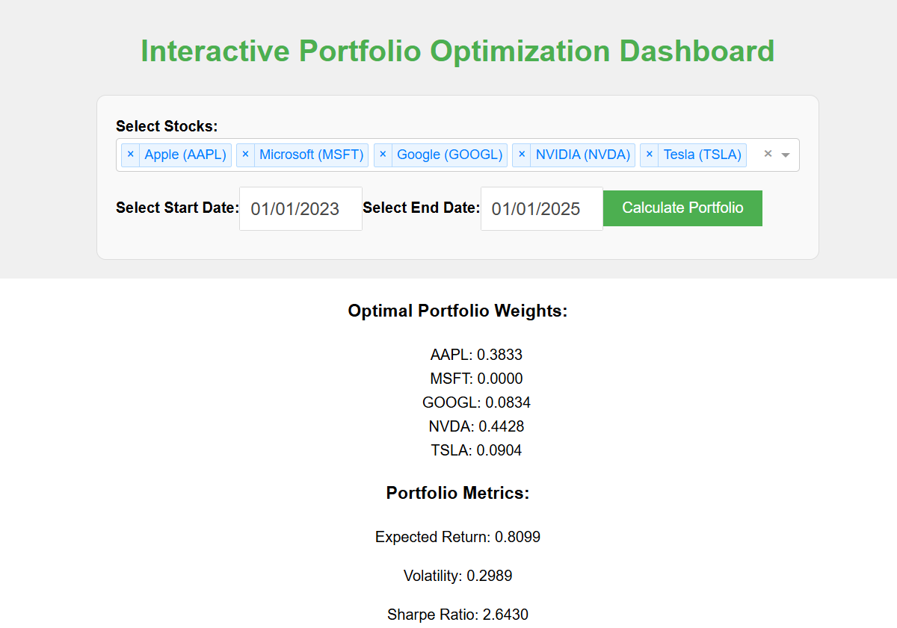

# Interactive Portfolio Optimization Dashboard

This project is a web-based dashboard for portfolio optimization using historical stock data. It allows users to select stocks, calculate optimal portfolio weights, and visualize the efficient frontier.

## Features

- Fetch historical stock data using Yahoo Finance.
- Optimize portfolio weights to maximize the Sharpe ratio.
- Display portfolio metrics such as expected return, volatility, and Sharpe ratio.
- Visualize the efficient frontier and the optimal portfolio.

## Requirements

- Python 3.7+
- Required Python libraries:
  - `yfinance`
  - `pandas`
  - `numpy`
  - `scipy`
  - `plotly`
  - `dash`

## Installation

1. Clone the repository:
   ```bash
   git clone <repository-url>
   cd <repository-folder>
   ```

2. Install the required libraries:
   ```bash
   pip install -r requirements.txt
   ```

## Usage

1. Run the dashboard:
   ```bash
   python dashboard.py
   ```

2. Open your browser and navigate to `http://127.0.0.1:8050`.

3. Select stocks, click "Calculate Portfolio," and explore the results.

## Example

Below is an example screenshot of the application:



## File Structure

- `dashboard.py`: Main application file containing the Dash app and portfolio optimization logic.
- `README.md`: Project documentation.

## License

This project is licensed under the MIT License. See the LICENSE file for details.